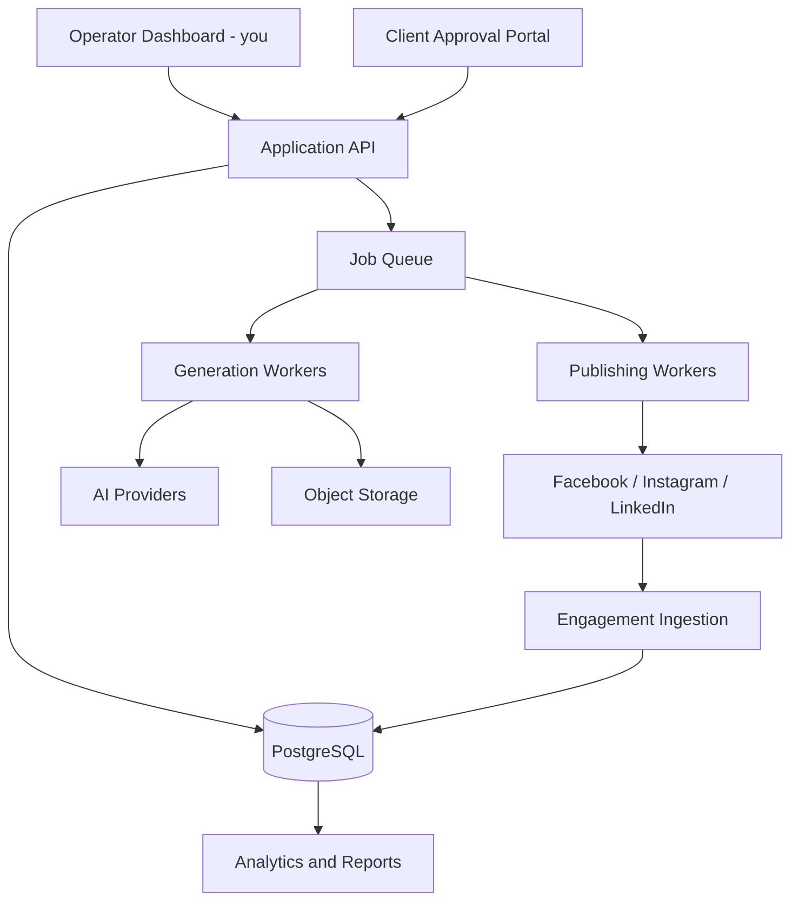

# Social Media Autonomous Agency — Business Plan
## Managed Social Media Service Powered by Proprietary AI

**Owner/Operator/Seller:** You
**Last updated:** 2026-08-10
**Status:** Internal working document — update as decisions change

---

## 1. What This Business Actually Is

This is **not** a self-service SaaS product at launch. It is a **technology-enabled managed service**:

> Clients pay you to run their social media. You use the Social Media Autonomous Agency engine internally to plan, write, design, publish, and optimize their content. Clients see results and approvals, not the machinery.

Think "social media agency with software leverage," not "software company with support."

**Why this model first:**
- You control quality while the engine is still maturing.
- You can charge agency-level prices ($750–$4,000/mo) instead of SaaS-tool prices ($20–$300/mo).
- Clients don't need to learn a tool or manage prompts/agents.
- You learn what real onboarding, controls, and reporting need to look like before building them for strangers to self-serve.
- The engine stays a competitive advantage instead of a commodity clients could churn away from.

**Path over time:** Managed Service → Managed Platform (clients can view/approve) → Hybrid (trusted clients edit calendars) → Optional self-service SaaS layer, only after the workflow is proven across many clients.

### The core positioning against SaaS competitors — remember this, it's the whole pitch
Generic SaaS social tools (Canva AI, Buffer AI, ChatGPT, etc.) give the client a blank template and a prompt box — the client still has to supply all the business knowledge (offers, voice, proof points, facts) every time they use it. **We invert that.** During onboarding we build a structured, durable profile of the client's actual business, and every post/caption/visual is generated *from that profile* — not from a generic template with their logo pasted on. This is why two clients in the same industry should never get near-identical content plans from us. If the current implementation ever produces generic, interchangeable content that could belong to any business in a category, that is a defect to fix immediately — it undermines the entire value proposition, not just content quality. This grounded-in-the-business approach is the single sentence to lead every sales conversation with: *"We don't sell you a tool — we build a system that actually knows your business, then run it for you."*

---

## 2. The Product You Are Selling

**Not:** "AI-generated social posts."
**Actually:** A run social media presence: strategy, content planning, copywriting, visuals, approvals, publishing, and monthly optimization — for businesses with or without products to sell.

### Core deliverables per client
- Brand & audience analysis
- Monthly content strategy and pillars
- Weekly editorial calendar
- Platform-specific copy (Facebook, Instagram, LinkedIn)
- Custom visuals
- Approval workflow (you send, client approves)
- Scheduled publishing
- Performance reporting
- Monthly strategy refinement

### Explicitly separate (upsell) services — do not bundle by default
- Community management / replying to comments & DMs
- Paid ad management
- Short-form video / Reels production
- Photography
- Influencer outreach
- Reputation management
- Crisis communications
- Multi-location rollouts
- Rush/same-day campaigns

---

## 3. Target Customers

### Ideal first segment
Owner-operated **service businesses** that know they need social media but can't post consistently:
- Contractors / home services
- Fitness studios, gyms, coaches
- Photographers
- Consultants
- Local venues / restaurants
- Outdoor / preparedness-adjacent businesses (natural fit given the founder's own niche experience)

**Why:** one lead is worth real money, owners are the bottleneck today, they have real photos/expertise to draw on, compliance is light, and results can be tied to calls/forms/visits.

### Avoid initially
Healthcare, legal, finance, supplements, political content, and some housing/employment ads — heavy compliance overhead not worth taking on in phase 1.

### Selection criteria per prospect
- Owner currently posts less than 1x/week or not at all
- Can supply real photos, testimonials, or project examples
- Has a clear "next step" for a customer (call, book, visit, buy)
- Willing to do a weekly 10-minute approval habit
- Not in a heavily regulated vertical

---

## 4. Service Packages & Pricing

Price around **operational involvement**, not just "number of posts."

| Plan | Price/mo | Platforms | Posts/mo | Includes |
|---|---:|---|---|---|
| Presence | $750–$1,000 | 2 | ~12 | Monthly report |
| Growth | $1,500–$2,000 | 3 | 20–24 | Weekly approvals, optimization |
| Authority | $2,500–$4,000 | 3 | 30+ | Campaigns, deeper reporting/strategy |
| Multi-location | Custom | 3 | Custom | Shared brand + per-location content |

### Onboarding fee (one-time, charged separately)
- $500–$1,500 for a straightforward single-location business
- $2,000+ for complex brands, large catalogs, or multiple locations

### Rules to protect margin
- Define 1–2 revision rounds per post/week — not unlimited revisions.
- Set a client approval deadline (e.g., 48 hours) after which content auto-publishes or slips a day — decide policy per client tier.
- Do not promise follower counts, virality, or guaranteed leads.

---

## 5. Unit Economics — What You Must Track

$$
\text{Gross Margin} = \text{Monthly Fee} - (\text{AI Cost} + \text{Storage} + \text{Platform Cost} + \text{Your Labor} + \text{Support})
$$

Track per client, monthly:
- Setup hours (one-time)
- Weekly review/approval time
- Revisions requested per post
- AI text generation cost
- AI image generation cost
- Publishing/troubleshooting time
- Reporting time
- Client acquisition cost
- Churn (cancelled/month ÷ total clients)
- Gross margin %

**Target:** no more than ~2–4 hours/month of your time per standard client after onboarding is complete. If a client is consistently costing 10+ hours/month, either reprice them, automate the bottleneck, or offboard them.

---

## 6. Onboarding Process (Per New Client)

1. Business questionnaire (goals, audience, offers, tone)
2. Website + existing social profile audit
3. Define primary business outcome (awareness / leads / traffic / sales / authority)
4. Audience definition
5. Products/services inventory
6. Content pillars (see §8)
7. Voice & style examples ("sound like this, not like that")
8. Claims, restrictions, compliance notes
9. Competitors and differentiators
10. Geographic market (if local)
11. Offers and destination links (booking page, shop, contact form)
12. Asset collection (logo, photos, testimonials with consent)
13. Social account authorization (OAuth — never ask for tokens via email/forms)
14. Approval contact + SLA agreement
15. Draft 30-day strategy — **you manually review before activating publishing**
16. First-week approval walkthrough call with client

**Rule:** Never turn on live publishing for a new client until you have manually reviewed the generated brand profile and first week of content.

---

## 7. Approval Models

Start every client at **Approval Required**. Earn trust into more autonomy over time.

| Tier | Behavior | When to use |
|---|---|---|
| Approval Required | Nothing posts until client approves each post | All new clients, sensitive industries |
| Weekly Approval | Full week sent once, one approval unlocks all | Standard/default tier after 4–8 weeks clean history |
| Trusted Autopilot | Pre-approved categories auto-publish; promos/sensitive/unusual claims still need approval | Only long-term, stable clients |

---

## 8. Content Model — Business-Wide, Not Just Product-Wide

Every client — even ones with no products — needs a **content pillar model**, not a product-posting machine.

### Universal content pillars (adapt per client)
- Education (teach something useful in their expertise)
- Customer problem solving / FAQs
- Brand authority / how we think about X
- Trust & company values / behind the scenes
- Community engagement (questions, polls, local relevance)
- Use cases / lifestyle
- Category or service education
- Direct product/service/offer promotion
- Conversion / lead-generation / booking CTA

### Default weekly mix (tune per client)
- 60–70% valuable non-promotional content
- 20–30% product/service education
- 10–15% direct conversion content
- No more than 2 consecutive promotional posts

### Content sources to model per client (not just "products")
Products, services, expertise, FAQs, customer problems, case studies, testimonials (with consent), team members, locations, events, offers/promotions, mission/values, community activity, relevant industry news, seasonal opportunities.

**Rule:** The planner decides the business objective and audience need *first*. It decides *afterward* whether an offer or product belongs in that specific post. Never force an unrelated product into an unrelated topic just because it's "next in the queue."

---

## 9. Platform-Specific Standards

- **Facebook:** conversational, community-oriented, useful examples, one clear CTA, encourages real comments.
- **Instagram:** concise, visual-first, strong opening line, controlled/relevant hashtags, no repeated boilerplate endings.
- **LinkedIn:** professional, insight-led, operational/business relevance, restrained selling language, frameworks over hard pitches.

**Non-negotiable rules for every post:**
- One clear idea, one CTA maximum
- Natural, human-sounding hooks (no "If the grid went down tonight, would your setup handle [article title as a question]?" style templates)
- No internal instructions, validation rules, or prompt scaffolding leaking into public copy (e.g., never "Use only published specs..." appearing in a caption)
- No claims the business can't verify
- No forcing an irrelevant product/service into unrelated content

---

## 10. Quality & Relevance Gates (What "Good" Means Before It Ever Reaches a Client)

Before any content is shown to a client for approval, it must pass:

1. **Semantic relevance gate** — the offering/topic combination makes logical sense (e.g., a water filter is never described as an electrical power source).
2. **Factual grounding gate** — no invented specs, prices, guarantees, or capabilities.
3. **Brand voice gate** — matches the client's approved tone and forbidden phrases.
4. **Platform fit gate** — right length, structure, and hashtag/CTA conventions per platform.
5. **Originality gate** — not a near-duplicate of recent content (same hook/scenario/structure).
6. **CTA gate** — exactly one primary call to action, appropriate to funnel stage.

### Scoring should reflect real publishability, not just structural completeness
Apply hard caps regardless of raw score:
- Semantic mismatch → max score 20
- Unsupported material claim → max score 40
- Leaked internal instructions in copy → max score 50
- Repeated scenario/structure → max score 65
- Failed visual check → max score 75

A rejected/blocked post should never retain a 90+ "quality score." If your internal tool shows this happening, treat it as a bug to fix before onboarding more clients — it means your quality signal can't be trusted for client-facing decisions.

---

## 11. Technical Architecture (What Needs To Exist to Run This for Multiple Clients)

### Recommended stack
- **Hosting:** Railway (app + workers)
- **Database:** PostgreSQL (replaces current JSON history files — not viable for multiple paying clients)
- **Queue:** Redis or Postgres-backed job queue with retries
- **Storage:** S3-compatible object storage for visuals/assets (current local file storage does not survive Railway restarts)
- **Secrets:** Encrypted storage for client social tokens, not plaintext JSON on disk
- **Logging:** Structured logs + error alerting (Slack/email at minimum)

### Core data models needed (multi-tenant from day one)
`organizations`, `users`, `organization_members`, `business_profiles`, `audiences`, `content_sources`, `products`, `services`, `content_pillars`, `brand_rules`, `social_connections`, `campaigns`, `calendar_slots`, `post_drafts`, `post_variants`, `approvals`, `media_assets`, `publish_jobs`, `published_posts`, `engagement_snapshots`, `conversion_events`, `client_feedback`, `subscriptions`, `usage_events`, `audit_events`.

**Rule:** every client-owned record must carry an `organization_id`/`workspace_id`, and every query must be scoped by it. No shared folders, filename prefixes, or "just be careful" isolation.

---

## 12. Operator Dashboard (Build This Before a Client Portal)

You need this before clients need anything:

- All clients' publishing status at a glance
- Posts awaiting your review
- Generate a week's plan on demand
- Edit copy / replace visuals inline
- Approve/reject, bulk-approve a client's week
- Pause a client or a specific platform
- Retry failed publications
- Expiring token warnings
- Content quality warnings
- Planned vs. published comparison
- Client edit/feedback history
- Engagement trend view per client
- Monthly report export

### Agency-wide ops view
- Posts due today across all clients
- Failed publications needing attention
- Pending client approvals
- Expiring social connections
- Clients below their posting cadence
- AI generation cost/usage this month
- Upcoming campaigns/events

---

## 13. Client Portal (Build Later, Keep It Narrow)

Give clients only:
- Calendar view
- Copy/visual previews
- Approve / reject / request changes
- Comments
- Asset upload
- New campaign/request form
- Performance summary
- Billing/account settings
- Emergency pause button

**Never expose:** agent configuration, prompts, model choices, raw orchestration/debug data, other clients' data, publisher credentials, internal quality-score internals.

---

## 14. Publishing Reliability Standard

"We called the API" is not good enough for a paid service. Required:
- Idempotency keys (no duplicate posts on retry)
- Durable job states in the queue
- Bounded retries with backoff
- Dead-letter handling for repeated failures
- Post-publish verification (confirm the post actually exists on the platform)
- Automatic token-expiry alerts
- Manual retry control in the dashboard
- Emergency pause per client/platform
- Full audit trail of who/what triggered each publish
- Client notification if a scheduled post misses its window

**Target: ≥98% successful publish rate for approved posts.**

---

## 15. Social Platform / Compliance Requirements

- Meta Developer App with Facebook Login for Business
- Proper Page + Instagram permissions, Meta App Review, business verification
- Privacy policy + data deletion callback endpoint
- Secure OAuth-based connection flow (never accept tokens via email/forms)
- LinkedIn app approval with correct posting permissions
- Clear disconnect/revoke flow per client
- Rotate your current query-string control token (`MANUAL_RUN_TOKEN` in URLs) → move to authenticated operator sessions with server-side authorization. Tokens in URLs leak via browser history, proxies, and logs.

---

## 16. Legal & Contracts (Get Professional Review — This Is a Checklist, Not Legal Advice)

- Master Service Agreement
- Statement of Work per client/plan
- Client approval responsibility clause (they're accountable for approving what's published)
- Content ownership terms
- AI-generated content disclosure
- Claims/source-data responsibility (who's liable if a claim is wrong)
- Copyright & asset licensing (photos, logos, testimonials)
- Testimonial/customer-content consent
- Platform account access terms
- Data processing agreement / privacy policy
- Confidentiality / NDA
- Cancellation & offboarding process (what happens to their data, access, history)
- Liability limitations
- Explicit "no guaranteed performance" clause
- Emergency content removal process

---

## 17. Measuring Success Per Client (No Vanity Promises)

Set **one primary objective per client** at onboarding:
Awareness · Engagement · Authority · Website traffic · Leads · Appointments · Event registrations · Store visits · Product revenue.

### Report monthly on:
- Posting consistency (planned vs. published)
- Reach & impressions
- Engagement rate
- Shares/saves
- Profile actions
- Follower growth
- Link clicks
- Leads generated (where trackable via UTM/forms)
- Cost per lead (if measurable)
- Best-performing topics, formats, CTAs, platforms
- Recommended focus for next month

**Always compare against the client's own prior baseline** — never generic industry benchmarks or guarantees.

---

## 18. Build Roadmap (Phased)

### Phase 1 — Prove the service on your own business first (now)
- Fix business-wide content planning (not product-only)
- Fix scheduling so funnel stage/channel conflicts don't waste most of the week
- Close the engagement-learning feedback loop
- Fix quality scoring so blocked/irrelevant content can't score 90+
- Establish your own weekly operating rhythm and reporting habits

### Phase 2 — Internal multi-client platform
- PostgreSQL migration (replace JSON history)
- Organization/workspace isolation
- Secure OAuth social connections
- Operator dashboard (§12)
- Durable job queue + object storage for media
- Approval states, audit logs, reliable retries
- Per-client cost tracking

### Phase 3 — Managed pilot (3–5 paying clients)
- Manually review every post before it goes to the client
- Log every edit, rejection, and hour spent
- Refine onboarding questionnaire and content templates from real friction points
- Build the first real monthly report template

### Phase 4 — Client portal
- Calendar, approvals, comments, asset upload, reporting, emergency pause

### Phase 5 — Scale
- Standardized packages
- Semi-automated onboarding
- Account-manager workflows
- Selective autopublishing for trusted clients
- Consider white-label/agency-reseller offering

---

## 19. The One Metric That Decides If This Works

> Can you manage **10 clients** with high quality, reliable publishing, measurable improvement, and healthy margins — **without you becoming the bottleneck**?

If a single client requires more than a few hours a month once onboarded, the workflow (not the client) needs to change before you scale further.

---

## 20. Open Decisions / Things to Revisit

- [ ] Exact pricing tiers once real labor cost per client is known
- [ ] Which verticals to actively pursue vs. avoid after first 5 clients
- [ ] Whether trusted autopilot is ever offered, and to whom
- [ ] When (or if) to build a self-service SaaS layer
- [ ] Legal review of MSA/SOW templates before signing first client
- [ ] Formal entity/business structure, insurance, and business banking setup
