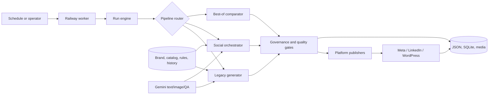

# Document 01 - Executive System Overview

## Executive summary

**VERIFIED:** The Infenergy Social Engine is a Python service that plans, generates, evaluates, and can publish social content for Infenergy Power across Facebook, Instagram, LinkedIn, and WordPress. It runs on Railway, exposes operational HTTP endpoints, schedules three daily content slots, and combines deterministic marketing rules with optional Google Gemini text, image, and visual-review calls.

It is best understood as a **brand-grounded social operating engine**, not as a free-roaming autonomous-agent swarm. A central runtime controls a pipeline of specialized modules. Those modules select a funnel stage, audience, topic, offering, persuasion strategy, copy shape, visual direction, and publishing destination; quality and claim controls then decide whether the output may proceed.

**VERIFIED:** The application has two generation paths plus a comparator:

| Path | What it does | Current significance |
|---|---|---|
| Legacy | Large mature generator with Gemini enrichment and deterministic fallbacks | Backward-compatible production path |
| Social Intelligence Orchestrator | Engine A/B/C strategy rotation, business context, claim ledger, quality review, visual contract | New reusable architecture; visible in current runtime history |
| Best-of | Runs both paths and chooses the higher deterministic score | Evaluation/migration mechanism, not outcome-based learning |

## What the application does

1. A time schedule or authenticated operator request initiates a slot.
2. The worker checks that no other slot run owns the process lock.
3. The run engine resolves funnel stage and channel eligibility.
4. The generator selects the legacy, orchestrator, or best-of path.
5. Deterministic strategy logic chooses the audience, persuasion method, topic, offer relationship, hook family, structure, and CTA.
6. Gemini may draft or refine copy, concepts, images, or QA judgments; deterministic fallbacks preserve operation when Gemini fails.
7. Claim, originality, brand, platform, quality, and visual checks evaluate the package.
8. Enabled publishers call Meta, LinkedIn, or WordPress APIs.
9. Results, quality metadata, external IDs, and history are persisted to JSON/SQLite artifacts.
10. Operational endpoints expose health, status, history, quality, inventory, schedules, and manual controls.

## Why it exists

**VERIFIED:** Repository business documents position the system as the internal technology behind a done-for-you social media service. The intended customer buys a managed outcome: strategy, content, visuals, approvals, publishing, and reporting. The operator uses the engine to reduce repetitive labor while retaining quality responsibility.

The central commercial thesis is: **build a durable structured model of each business, then generate from that model instead of asking the customer to prompt a generic tool repeatedly.** This thesis is strong, but the current runtime proves it only for one brand, Infenergy.

## What is genuinely valuable

### Technology

- **VERIFIED:** data-driven conversion logic covering awareness, emotion, persuasion logic, objections, transformations, copy structures, hooks, CTAs, and quality scoring;
- **VERIFIED:** graceful degradation from Gemini to deterministic generation;
- **VERIFIED:** explicit claim provenance and forbidden-claim boundaries;
- **VERIFIED:** platform-specific adaptation and independent publishers;
- **VERIFIED:** business-intelligence and offering contracts that are more reusable than the Infenergy data loaded into them;
- **VERIFIED:** live operational controls, schedule logic, anti-repeat memory, and visual generation/fallback paths.

### Business

- **INFERRED:** one trained operator could manage more content volume than a conventional manual workflow;
- **INFERRED:** structured business context can reduce generic output and onboarding rework;
- **INFERRED:** deterministic fallbacks and gates can reduce service interruption and reputational risk;
- **MISSING/UNKNOWN:** measured customer labor savings, conversion lift, retention, CAC, churn, and multi-client gross margin.

## Current operating reality

Observed on Railway on 2026-08-26:

| Observation | Evidence state | Meaning |
|---|---|---|
| Social Engine online | VERIFIED | The deployed control service was healthy |
| Image Studio online | VERIFIED | A second visual service existed in the Railway project |
| `dry_run=true` | VERIFIED | The observed runtime was not live-publishing |
| Gemini configured | VERIFIED | Provider credentials/config existed |
| Gemini budget telemetry unavailable | VERIFIED | Configuration does not prove billable calls can currently complete |
| Recent A-engine candidate records | VERIFIED | The orchestrator generated and stored candidate packages |
| Visual repeat rate 92-96% across measured dimensions | VERIFIED | Current visual diversity is unhealthy |
| Meta analytics source errors | VERIFIED | Meta performance ingestion was not functioning correctly |
| LinkedIn analytics unconfigured | VERIFIED | Cross-channel learning was incomplete |
| No pending owner proposals | VERIFIED | No active owner-review items were exposed by status |

The live status therefore proves generation and operational intelligence, but not reliable live publishing, human approval, closed-loop learning, or customer ROI.

## Architecture in one view

## Human and system responsibilities

| Responsibility | Current owner |
|---|---|
| Supply company truth, product facts, claims, credentials | Human/operator |
| Configure schedule, channels, thresholds, and live mode | Human/operator |
| Select routine strategy and assemble candidates | Software |
| Draft/refine copy and images | Gemini when available; deterministic fallback otherwise |
| Apply automated quality and claim controls | Software |
| Approve client content before publication | **MISSING in runtime**; described as a human service process |
| Resolve platform failures and questionable claims | Human/operator |
| Learn from engagement | Partial software substrate; current ingestion is not operational end to end |

## Principal strengths

1. **Architecture:** rules and business truth remain usable when an AI provider fails.
2. **Governance:** claim and quality concerns are represented as data rather than hidden in prompts alone.
3. **Reusability:** conversion, scheduling, platform, and orchestration modules are largely brand-independent.
4. **Operational depth:** the service includes publishing, token handling, status endpoints, media paths, and recovery logic, not merely content generation.
5. **Commercial coherence:** managed-service positioning fits the present need for human review and operational intervention.

## Principal weaknesses

1. Single-tenant file/SQLite persistence prevents credible enterprise isolation and horizontal scaling.
2. There is no durable job queue, missed-run recovery, dead-letter workflow, or transactionally consistent publish ledger.
3. The client approval promise is not enforced by an implemented approval state machine.
4. Analytics failures prevent the claimed learning system from measuring and improving outcomes.
5. Current visual generation shows severe repetition.
6. Large dictionary contracts and a highly coupled legacy generator create silent field-loss and maintenance risk.
7. Observability is operationally useful but not enterprise grade: no structured metrics, tracing, alerting, cost ledger, or SLO dashboard.

## Commercial conclusion

**RECOMMENDED:** Commercialize first as a **hybrid managed AI service with proprietary operating software**, not as self-service SaaS. Sell accountable management and measurable workflow outcomes while the platform remains supervised. Build an internal multi-client control plane, approvals, durable jobs, analytics, and tenant isolation before exposing the machinery to customers.

The strongest initial category statement is:

> This is not an AI post generator. It is a business-grounded social operations system, run as a managed service.

## Immediate priorities

1. Restore and verify analytics ingestion for Meta; add LinkedIn analytics support.
2. Implement a durable approval state machine that blocks every new client's content by default.
3. Move client-owned state to PostgreSQL with `organization_id` isolation and encrypted credential references.
4. Add a durable queue, idempotency, retries, missed-run recovery, and post-publication verification.
5. Correct visual novelty before presenting the system as autonomously creative.
6. Pilot with 3-5 external customers and measure labor, API cost, publish success, revisions, retention, and customer outcomes.

## Bottom line

**VERIFIED:** A substantial social generation and publishing engine exists and is deployed.  
**INFERRED:** Its deterministic strategy, business-profile, governance, and fallback patterns can become a reusable platform.  
**MISSING/UNKNOWN:** proof that it improves customer outcomes or can operate profitably across multiple isolated customers.  
**RECOMMENDED:** prove the managed service, harden the operational control plane, then productize selectively.
