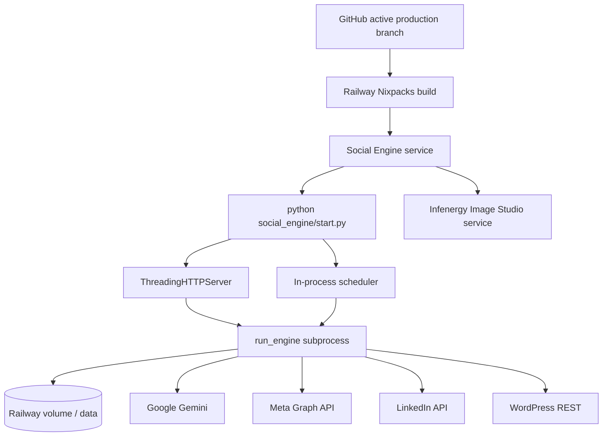
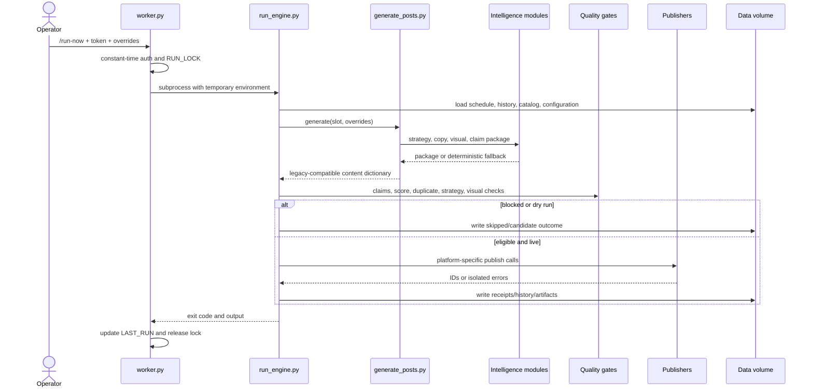
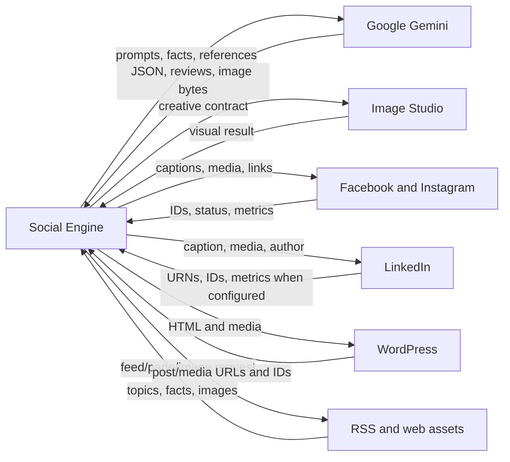

# Document 02 - Technical Architecture

## Executive summary

**VERIFIED:** The application is a single Railway-hosted Python process with an HTTP server and in-process scheduler. It starts slot work in a subprocess, routes generation through one of three pipeline modes, applies deterministic gates, invokes external publishers sequentially, and persists state to a Railway volume using JSON, SQLite, and media files. It is modular internally but not distributed, multi-tenant, or queue based.

## Component inventory

| Layer | Owning components | Responsibility | Failure effect |
|---|---|---|---|
| Interface | `worker.py::HealthHandler` | Health, status, previews, runs, agents, inventory, OS UI, custom posts | Endpoint unavailable or unsafe action rejected |
| Control | `worker.py`, `social_engine/start.py` | Scheduler, locks, subprocesses, auth, runtime state | All automatic/manual runs stop |
| Orchestration | `scripts/run_engine.py`, `scripts/generate_posts.py` | Eligibility, pipeline routing, retry, gates, publish sequence | No governed content delivery |
| Intelligence | `scripts/conversion/`, `scripts/social/`, `scripts/business_intelligence/` | Strategy, context, selection, claims, quality, model calls | Fallback or reduced grounding |
| Tools | `scripts/publish_*.py`, `scripts/social_visuals.py` | Gemini, Meta, LinkedIn, WordPress, image processing | Per-provider/channel degradation |
| Data | `data/`, `scripts/inventory_db.py` | Catalog, profile, history, rules, artifacts, receipts | Stale context or lost memory |
| Evaluation | score, claim, anti-repeat, strategy, human-connection modules | Reject/revise/approve decisions | Unsafe or low-quality output if bypassed |
| Infrastructure | `railway.json`, `nixpacks.toml`, Railway volume | Build, process, healthcheck, persistence | Service or state unavailable |

## Deployment architecture

**VERIFIED:** Railway showed the Social Engine and Image Studio online and a 13 GB mounted volume at `/data`. `railway.json` starts `social_engine/start.py`, checks `/health`, and restarts on failure up to five times.

## Entrypoints and triggers

| Trigger | Receiver | Execution |
|---|---|---|
| Railway process start | `social_engine/start.py` | Calls `worker.main()` |
| Three daily UTC times | `schedule` jobs in `worker.main()` | Calls `run_slot()` |
| Authenticated `/run-now` | HTTP handler | Starts a daemon thread, then slot subprocess |
| `/content-preview` | HTTP handler | Generates without publisher execution; can still write artifacts/memory |
| `/custom-post` POST | HTTP handler | Validates external payload and calls selected publishers |
| `/monthly-generation-start` | HTTP handler | Starts locked background generation/pregeneration workflow |
| Direct CLI/PowerShell | scripts and wrappers | Operator-controlled alternate entrypoints |

Scheduler defaults are 13:00, 17:00, and 23:00 UTC. **Risk:** the Central-time comments do not create daylight-saving awareness. Jobs are memory-only and missed runs are not caught up after restart.

## Request lifecycle

## Pipeline routing

**VERIFIED precedence:** explicit `pipeline_override` > `POST_PIPELINE_OVERRIDE` > `CONTENT_PIPELINE` > `ENABLE_SOCIAL_INTELLIGENCE` > legacy default.

- Legacy: mature, coupled generator; direct Gemini JSON model chain; deterministic captions and platform adapters as fallback.
- Orchestrator: business context -> Engine A/B/C -> copy beats -> visual concepts -> claim ledger -> 20-factor quality -> provider result -> compatibility bridge.
- Best-of: generate both and select by internal score. It doubles generation work and is not an outcome-based bandit.

## External integration map

| Integration | Data sent | Data returned | Control |
|---|---|---|---|
| Gemini | prompts, business facts, selected reference images | JSON copy/concepts/reviews and image bytes | API key, routed models, fallback |
| Meta | captions, media, URLs, tokens | post/media IDs, status, metrics | page/IG credentials, retries |
| LinkedIn | captions, media, author/org identity | URNs/post IDs | OAuth credentials/version |
| WordPress | HTML, media, Basic auth | post/media IDs and URLs | optional publisher/host |
| Entertainment/Image Studio | creative contract, references | visual output/status | URL/token and route rules |
| RSS/site assets | feed/image/page requests | topics and media | URL safety and timeouts |

## Failure and recovery behavior

- **VERIFIED:** `RUN_LOCK`, `CUSTOM_POST_LOCK`, and `MONTHLY_GENERATION_LOCK` serialize conflicting work within one process.
- **VERIFIED:** Gemini failures return `None` or fallback artifacts; 429 exhaustion can mark the provider unavailable until process restart.
- **VERIFIED:** generation retries up to three attempts for revisable failures.
- **VERIFIED:** platform failures are isolated so another platform may continue.
- **VERIFIED:** Railway restarts failed processes; in-process schedule state and `LAST_RUN` are lost.
- **PARTIAL:** publish receipts reduce duplicate risk, but JSON writes and external API side effects are not one transaction.
- **MISSING:** durable queue, dead-letter handling, missed-run replay, distributed lock, full post-publish reconciliation, automated incident alerting.

## Architectural assessment

| Dimension | Score | Rationale |
|---|---:|---|
| Architecture | 7 | Strong layered concepts; control and legacy generator remain highly coupled |
| Modularity | 7 | Reusable packages exist; dictionary bridges and mega-module weaken boundaries |
| Scalability | 4 | Single process, local volume, O(N) history, no queue or tenancy |
| Reliability | 6 | Fallbacks/retries/locks are useful; no durable orchestration |
| Maintainability | 6 | Good tests and explicit modules; schema drift and duplicated paths remain risky |
| Extensibility | 7 | Provider, engine, library, and publisher seams exist |
| Enterprise readiness | 3 | Missing tenancy, IAM, audit, approval, observability, DR |

## Reconstruction order

1. Recreate typed domain contracts for Organization, BusinessProfile, Offering, StrategicBrief, ContentPackage, Approval, PublishJob, and PerformanceEvent.
2. Port deterministic conversion and governance libraries with golden tests.
3. Implement provider-neutral model and visual interfaces with recorded prompts/costs.
4. Implement platform adapters behind idempotent publish jobs.
5. Add PostgreSQL, object storage, encrypted secret references, and a durable queue.
6. Rebuild operator and approval interfaces.
7. Migrate one Infenergy workflow, compare outputs, then cut over behind feature flags.

## Priority recommendations

Move orchestration state to durable jobs; replace implicit dictionaries with versioned schemas; split generation from publishing workers; centralize configuration; add request/run correlation IDs; and keep the current deterministic fallback behavior as a non-negotiable platform property.
