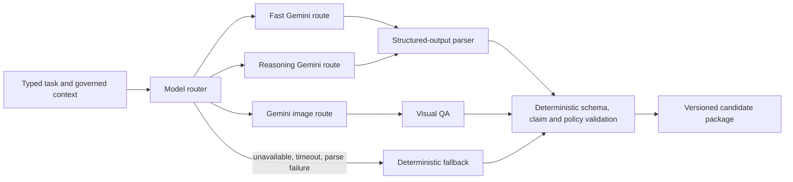

# Document 03 - Agent and Intelligence Architecture

## Executive summary

**VERIFIED:** The repository uses “agent” for several different abstractions: deterministic strategy modules, optionally model-assisted utilities, a social orchestrator, a deterministic marketing-team workflow, and declarative conference roles. These do not autonomously converse. Coordination occurs through direct function calls, shared data contracts, files, and one HTTP dispatcher.

## Coordination model

```mermaid
flowchart TD
    RC[Run context/control plane] --> CS[Conversion Strategist]
    CS --> SB[Strategic Brief]
    SB --> ORCH[Social Orchestrator or Legacy Generator]
    BI[Business Intelligence] --> ORCH
    MEM[History and learning context] --> ORCH
    ORCH --> MR[Model Router / Gemini]
    ORCH --> GOV[Claims, quality, strategy and visual governance]
    GOV --> PKG[Content package]
    DISP[/agents/run dispatcher] --> UTIL[One utility agent at a time]
    CONF[Agent conference] -. readiness contracts .-> UTIL
```

No message bus, autonomous supervisor loop, delegated tool permission system, or cross-agent chat protocol was found.

## Core intelligence registry

| Component | Type | Inputs | Output/authority | Failure behavior |
|---|---|---|---|---|
| ConversionStrategist | Deterministic strategic agent | stage, product, audience, history hints | StrategicBrief; highest creative strategy authority | Uses library defaults |
| ConversionLogicEngine | Deterministic decision engine | same plus conversion libraries | awareness, emotion, law, structure, objection, CTA | Fails on invalid contract; otherwise fallback selections |
| SocialIntelligenceOrchestrator | Orchestrator | BI context, history, platform, offering | full candidate package | Gemini calls fall back deterministically |
| Engine A | Deterministic conversion engine | recent state, audience, season, offering | conversion-led EngineBrief | shared fallback brief |
| Engine B | Deterministic audience-value engine | recent state and audience | education/value-led EngineBrief | shared fallback brief |
| Engine C | Deterministic brand/community engine | recent state and audience | community/identity EngineBrief | shared fallback brief |
| ModelRouter | AI gateway | task, prompt, system instruction | parsed Gemini JSON or `None` | model fallback/fail-fast after provider exhaustion |
| QualityIntelligence | Deterministic evaluator | copy, strategy, platform, claims | 20-factor score and review band | conservative findings/defaults |
| Claim intelligence/governance | Deterministic evaluator | content and verified offering facts | ledger, provenance, blocking summaries | unverified claims remain flagged |
| Visual intelligence/provider | Rules plus optional Gemini | strategy, copy, product, references | creative request, recipe or pixels | template/pre-render fallback |
| Business Intelligence Foundation | Data/compiler system | manifesto, catalog, evidence, research, overrides | versioned profile and compiled contexts | stale/partial profile possible |

## HTTP-dispatchable utility agents

| Agent | Responsibility | Model/tool | Memory/data | Authority |
|---|---|---|---|---|
| engagement_ingestion | Retrieve platform engagement | Meta API/rules | post IDs, credentials | Writes/returns metrics; source failures possible |
| performance_reflection | Summarize winners/losers | Deterministic statistics | history/metrics | Advisory patterns |
| learning_ingestion | Turn metrics into learning signals | Deterministic | metrics, BI learning ledger | Advisory persisted signal |
| topic_intelligence | Find timely topics | RSS/rules | feeds and topic state | Advisory opportunities |
| carousel_slide_writer | Build five-slide structure | Gemini + fallback | brief/product | Draft copy only |
| visual_qa_reviewer | Review visual compliance | Gemini + fallback | image/expectations | Advisory/gate packet |
| product_matcher | Match topic/customer moment to offering | Rules | catalog/briefs | Offering recommendation |
| brand_voice_drift | Detect voice deviation | Linguistic rules | profile/history | Warning |
| hashtag_intelligence | Select hashtag set | Rules/library | topic/platform | Draft metadata |
| alt_text_accessibility | Produce accessible description | Gemini + fallback | visual context | Draft alt text |
| posting_time_optimizer | Recommend time | Heuristics | history/engagement | Scheduling advice |
| product_intelligence | Build grounded product artifact | Parsers/rules | CSV/briefs | Verified-fact boundary |
| ab_variant_orchestrator | Create controlled variants | Rules | candidate/variables | Experiment candidates |
| crisis_relevance | Assess current-event relevance | Feed/rules | external events | Advisory risk/relevance |
| cross_post_recycler | Adapt previous content | Rules | history/platform standards | Draft variants |
| retention | Manage retained artifacts | Filesystem/rules | stored history/artifacts | Cleanup policy action |

**VERIFIED:** `conversion_strategist` participates in generation but is not one of the dispatcher’s utility-agent entries.

## Marketing-team roles

The repository documents eleven roles: market research, audience psychology, brand voice, offer strategy, copywriting, creative direction, channel editing, SEO, lifecycle email, growth experimentation, and conversion QA. **VERIFIED:** `social_engine/marketing_team/` produces strategy and weekly artifacts. **CAUTION:** role names represent workflow responsibilities; they should not be sold as eleven independently reasoning workers without runtime evidence.

## Decision authority

1. Human-authored business truth, locked owner assertions, and verified product facts.
2. Run context: slot, stage, product/platform/pipeline overrides.
3. StrategicBrief and strategy lock.
4. Copy/visual generation and deterministic fallback.
5. Claims, quality, duplication, visual, and readiness gates.
6. Publish decision and operator live-mode configuration.

Gemini is an expression and synthesis tool, not the source of business truth. It must not override forbidden claims, product facts, or approval requirements.

## Prompt and model architecture



- Legacy calls use a Gemini candidate chain and expect JSON for ideation, psychographics, narrative, voice, hook, safety, novelty, visual, CTA, and final copy tasks.
- Orchestrator calls use task routing for copy beats and concept stems.
- Image calls use a Gemini image model with aspect ratio, exact text, product references, brand style, and negative constraints.
- Visual QA sends the rendered image plus expected headline/CTA/product requirements.
- **VERIFIED:** prompts are only partially registered/versioned; direct calls are not comprehensively represented in a cost ledger.

## AI necessity analysis

| Task | Best execution |
|---|---|
| Schedule, eligibility, claims, schema validation, idempotency | Deterministic only |
| Persona/stage/rule selection | Deterministic, explainable |
| Copy drafting and stylistic variation | Fast generative model with structured output |
| High-risk factual review | Deterministic evidence match, optionally stronger model as secondary critic |
| Image generation | Image model, but only after deterministic concept/claim gate |
| Performance aggregation | Deterministic analytics |
| Strategy recommendations from sufficient outcome data | Rules/statistics first; stronger model for explanation |

## Recommended routing

Use a low-cost fast model for copy variants, formatting repair, alt text, and concept expansion; a stronger reasoning model only for ambiguous evidence synthesis, sensitive campaign review, and cross-source strategy; an image model only for approved creative contracts. Enforce JSON Schema, timeout, token/cost ceilings, caching, redaction, and deterministic post-validation for every call.

## Risks and improvements

- Rename deterministic helpers as “services” or “evaluators” where agent language obscures authority.
- Introduce a typed AgentResult containing input version, output version, evidence IDs, model/prompt version, cost, latency, confidence, and failure mode.
- Require every AI output to identify source evidence and unresolved assumptions.
- Keep agent permissions least-privileged; generation components should never hold publisher credentials.
- Do not claim autonomous learning until engagement ingestion and outcome feedback are continuously verified.
