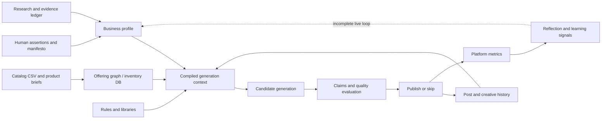
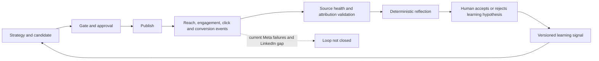

# Document 04 - Data, Memory and Knowledge Architecture

## Executive summary

**VERIFIED:** The system knows what it knows through authored JSON knowledge, WooCommerce-derived catalog data, product briefs, SQLite caches/settings, generated business profiles, post/creative history, evidence and learning ledgers, environment configuration, and optional external research/engagement retrieval. There is no vector database or embedding retrieval in the audited application.

## Information classes

| Class | Current source | Authority | Lifecycle |
|---|---|---|---|
| Business identity/voice | manifesto, brand profile, owner overrides | Human-authored/locked | Manual update, profile rebuild |
| Product truth | CSV, product briefs, offering graph, verified facts | External snapshot plus curated facts | Sync/rebuild |
| Marketing rules | funnel, channel, CTA, anti-repeat, conversion/social libraries | Authored configuration | Version manually |
| Campaign context | timestamped strategy/weekly/campaign artifacts | Derived | Newest artifact generally wins |
| Operational memory | `post_history.json`, receipts, last outcome | Runtime history | Appended/truncated inconsistently |
| Creative memory | content/visual memory and signatures | Runtime derived | Used for rotation/novelty |
| Performance memory | engagement metrics, reflection, learning JSONL | Intended outcome evidence | Currently incomplete/broken live ingestion |
| Secrets/runtime controls | Railway environment, token state | Operator/provider | Rotation/refresh |

## Data-flow lifecycle

## Storage ownership

### SQLite

`scripts/inventory_db.py` owns products, singleton brand profile, selling ideology, style-reference repository, visual settings, and sync state. `data/intelligence_os.db` supports creatives, conversations, approvals/transactions/jobs for the Intelligence OS surface. **Risk:** schema initialization is code-driven and no formal migration framework was verified.

### JSON and JSONL

JSON stores schedules, rules, profiles, product briefs, history, receipts, run status, monthly jobs, living intelligence, creative memory, and generated artifacts. JSONL is used for append-oriented evidence/learning records. **Risk:** multiple writers and defensive `.get()` readers permit incompatible history shapes and silent field loss.

### Media

Generated visuals and public media live on the mounted volume. Remote product/style images are referenced by URL. No comprehensive retention/object-lifecycle policy was verified.

## Memory taxonomy

| Memory type | Implementation | How it influences decisions | Gap |
|---|---|---|---|
| Short-term/run | dictionaries, environment overrides, `LAST_RUN` | current slot and status | lost on restart |
| Episodic | post history and platform records | duplicates, recent success, stage distribution | schema conflict and O(N) scans |
| Semantic | manifesto, profile, product facts, libraries | grounding and strategy | freshness/conflict rules incomplete |
| Creative | hook/topic/visual signatures | least-recently-used rotation | live visual repetition remains severe |
| Performance | metrics and learning signals | intended winner/loser bias | ingestion currently fails/unconfigured |
| Governance | evidence ledger, forbidden claims, owner overrides | claim and profile boundaries | provenance coverage varies |

## Feedback-loop diagram

The target loop requires both valid source events and human-reviewed strategy changes. Current production status demonstrates that this loop is not operating end to end.

## Retrieval and ranking

- Anti-repeat normalizes and hashes captions, openings, hooks, CTAs, topics, product features, scenarios, and lessons within configurable windows.
- Candidate-pool logic uses cooldowns and least-recently-used dimensions.
- Funnel selection measures recent distribution deficits subject to channel/slot constraints.
- Product/audience/awareness/structure selection uses deterministic mapping, fit heuristics, recent exclusions, and optional winning/losing hints.
- Latest campaign/profile artifacts may be selected by file modification time rather than explicit semantic version.
- **MISSING:** embedding search, calibrated relevance benchmark, unified source ranking, and formal conflict-resolution workflow.

## Knowledge admission and validation

1. Human or catalog source enters the repository/volume.
2. Parsers normalize descriptions, metrics, images, and offering relationships.
3. Evidence/profile modules compile source material into reusable context.
4. Product briefs define verified facts, constraints, and forbidden claims.
5. Generation prompts receive selected facts, not unrestricted authority to invent.
6. Deterministic validators compare generated claims to available evidence.
7. Unverified high-risk claims can block a package; medium-risk claims are surfaced.

**Observed defect:** recent runtime records contained unverified claims, weak credibility, and a product with an empty verified-facts list. This demonstrates that ledger visibility is stronger than source completeness.

## Retention, forgetting and updating

**VERIFIED:** some runtime writers limit retained history, but no single documented retention schedule governs all JSON, SQLite, campaign, image, evidence, and customer records. There is no customer data deletion/export workflow in the active single-tenant runtime.

**RECOMMENDED policy:**

- immutable evidence and audit records: contract/legal retention period;
- post and performance events: 24 months online, then archive;
- raw model prompts/responses: 90 days unless incident/legal hold;
- generated drafts never approved: 30–90 days;
- media: active campaign plus defined archive period;
- secrets: never in content history, rotate by provider policy;
- customer deletion: verified, logged cascade with legal-hold exception.

## Target data architecture

Use PostgreSQL with tenant-scoped typed tables, object storage for media, an encrypted secrets manager, and a durable event/job ledger. Every record should include `organization_id`, schema version, source/provenance, created/updated timestamps, actor, retention class, and correlation/run ID. Add optimistic concurrency for profile updates and immutable audit events for approval and publication.

## Priority actions

1. Define and validate versioned schemas for every cross-module contract.
2. Assign one owner/writer to each history and memory type.
3. Repair Meta and LinkedIn metric ingestion and prove metrics-to-decision lineage.
4. Add semantic versioning and freshness policy to business profiles/campaigns.
5. Establish data classification, retention, export, deletion, backup, and restore tests.
6. Add evidence coverage metrics: claims with source, offerings with verified facts, stale sources, and conflicts awaiting owner resolution.
