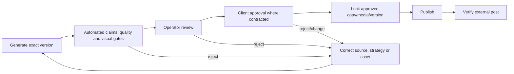

# Document 05 - Process and SOP Manual

## Purpose and operating rule

This manual covers the present single-tenant runtime and marks future controls explicitly. **VERIFIED:** current automated publishing is controlled by `SOCIAL_DRY_RUN`, channel credentials, eligibility, and code gates. **MISSING:** a durable client approval state machine. Until implemented, the operator must keep dry run enabled and publish only after documented external approval.

## SOP 1 - Daily slot run

| Field | Procedure |
|---|---|
| Purpose | Produce a governed candidate and, only when authorized, publish eligible variants |
| Trigger | In-process morning/midday/evening schedule or authenticated `/run-now` |
| Inputs | slot, schedule, funnel rules, business/profile data, catalog, history, credentials, live mode |
| Responsible | `worker.py` -> `scripts/run_engine.py` |
| Steps | Authenticate/trigger; acquire lock; refresh due tokens; resolve stage/channels; generate; validate; score; duplicate-check; visual-check; publish/skip; persist outcome |
| Decisions | pipeline, stage, product/topic, retry/reject, channel eligibility, live/dry behavior |
| Output | history record, candidate/media, publisher IDs/errors, logs |
| Failure | timeout, provider failure, gate rejection, platform error, history-write failure |
| Recovery | preserve dry run; inspect `/status`, `/history`, `/quality-report`; correct source/control; rerun with same scope; verify no prior external ID before live retry |
| Measure | publish success, gate reasons, duration, retries, cost, duplicate rate |

## SOP 2 - Content preview and approval

1. Generate via protected `/content-preview` using explicit slot, stage, product, and pipeline where needed.
2. Review every platform caption, visual, destination URL, claim ledger, quality reasons, product match, and accessibility text.
3. Record approver, timestamp, exact content/media versions, changes, and approval scope outside the current runtime.
4. Reject any unsupported material claim, mismatched product, repeated creative, broken URL, inaccessible visual, or internal prompt leakage.
5. **Do not infer approval from silence.** The business plan’s optional auto-publish-after-deadline rule requires a signed customer policy.
6. Publish only the exact approved version. If generation changes it, approval is invalid.

**RECOMMENDED future state:** Draft -> Internal Review -> Client Review -> Approved -> Scheduled -> Publishing -> Published/Failed/Cancelled, with immutable transitions and emergency pause.

## SOP 3 - Live publishing

Preconditions: approval evidence exists; `production-readiness` is green; destination/media are reachable; tokens are healthy; no pending receipt exists; campaign window remains valid.

Sequence: enable the intended platforms and live scope -> trigger one run -> monitor logs/status -> verify external post exists -> capture external IDs/permalinks -> compare rendered post to approval -> restore conservative flags -> notify owner of outcome.

Failure recovery: stop retries when external side effect is ambiguous; check receipts and platform directly; delete only with explicit authority; never regenerate and republish merely because local history is missing.

## SOP 4 - Custom post intake

Validate token and JSON; require unique `external_id`; allow only HTTPS media; enforce caption length and 2–10 carousel assets; verify platform list and ownership; publish under `CUSTOM_POST_LOCK`; persist per-platform result. A repeated `external_id` must be treated idempotently.

## SOP 5 - Monthly generation

Start one job; record job ID, date range, and requested package count; monitor phases through `/monthly-generation-status`; inspect generated packages before any live dispatch; reconcile completed/failed/deferred packages. If the process restarts, manually compare persisted job state and outbox before restarting because durable replay is incomplete.

## SOP 6 - Inventory and business-knowledge update

1. Preserve a source snapshot and provenance.
2. Run inventory sync and review additions, updates, missing products, price/stock/image changes.
3. Update product briefs and verified facts; never promote marketing prose automatically into verified claims.
4. Rebuild/review Business Intelligence profile.
5. Run product/claim tests and preview representative product and non-product posts.
6. Apply brand/ideology only after owner review.
7. Record profile/catalog version used for subsequent runs.

## SOP 7 - Analytics and learning

Retrieve platform metrics -> validate post-ID mapping and source status -> normalize metrics -> run performance reflection -> review winner/loser hypotheses -> record approved learning signal -> rebuild profile/context if appropriate -> run a controlled experiment. **Current status:** Meta retrieval is failing and LinkedIn analytics is unconfigured; do not claim closed-loop optimization.

## SOP 8 - Credential rotation

Use provider OAuth/console and Railway secret variables; never transmit tokens in email or documentation; rotate one integration at a time; verify readiness and a dry-run/API probe; revoke old credential; record actor/time/scope. Query-string control tokens should be replaced by authenticated sessions because URLs leak into histories/logs.

## SOP 9 - Incident response

| Phase | Action |
|---|---|
| Detect | Alert on missed slot, failed publish, duplicate, wrong claim, credential error, cost spike, or data exposure |
| Contain | Set dry run, pause affected channel/customer, revoke exposed token, stop retries |
| Assess | Identify content/version, customers, platforms, data, time window, and external IDs |
| Correct | Remove/correct content with authorization; rotate secrets; repair source/control |
| Recover | Run scoped tests and dry run; resume gradually; verify external state |
| Learn | Preserve evidence; root-cause review; update controls/tests/SOP; customer/legal notice as required |

## Daily and weekly operator checklists

Daily: health, uptime/redeploy, last actual publication, failed receipts, token expiry, candidate pool, visual novelty, analytics errors, approvals due, missed windows.  
Weekly: planned vs published, quality/rejection distribution, repeated hooks/scenes, claim-source coverage, platform metrics, revisions, labor, model spend, incidents, next-week campaign and inventory changes.
