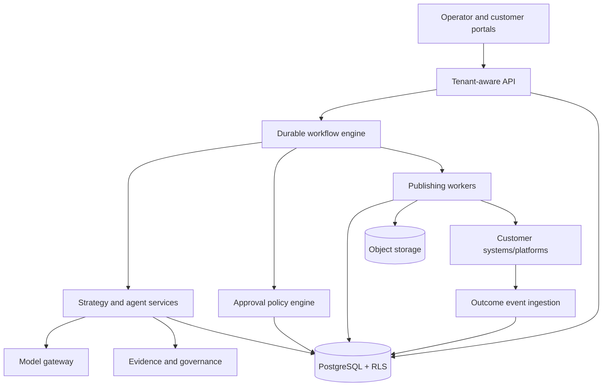

# Document 07 - Reusable Platform Blueprint

## Reuse conclusion

**INFERRED estimate:** 55–70% of the conceptual intelligence and integration code is reusable for another low-regulation business; only 25–40% of the current runtime can be reused unchanged for a secure multi-customer platform. The difference is tenancy, data contracts, approvals, durable operations, and customer-specific grounding.

## Separation model

| Category | Examples | Treatment |
|---|---|---|
| Universal core | conversion logic, model gateway, quality/claim framework, scheduler concepts, platform adapters, experiment contracts | Product code with versioned interfaces |
| Industry pack | terminology, prohibited claims, compliance gates, personas, benchmarks, channel norms | Versioned installable configuration/module |
| Customer configuration | brand voice, offerings, evidence, audience, locations, approvals, goals | Tenant data, never source-code forks |
| Integrations | CRM, commerce, DAM, social OAuth, analytics, web CMS | Connector layer with scoped credentials |
| Proprietary intelligence | strategy graph, evidence-aware brief, deterministic fallback, governance and outcome learning | Keep centrally tested and access controlled |

## Target equation

$$
\text{Customer AI System}=\text{Core Platform}+\text{Industry Pack}+\text{Customer Knowledge}+\text{Workflows}+\text{Integrations}
$$

## Required domain contracts

Organization, Workspace, User, Role, BusinessProfile, EvidenceSource, Offering, Audience, BrandRule, IndustryPolicy, Campaign, ContentBrief, ContentPackage, Claim, MediaAsset, Approval, PublishJob, PlatformConnection, EngagementEvent, ConversionEvent, Experiment, LearningSignal, UsageEvent, AuditEvent.

Every contract needs tenant ID, schema version, provenance, actor, timestamps, sensitivity, retention class, and idempotency/correlation fields where applicable.

## Configuration hierarchy

Platform defaults -> industry pack -> organization policy -> campaign overrides -> one-run override. Lower levels may narrow safety but must not weaken locked regulatory or evidence controls without privileged, audited exception.

## Multi-tenant implementation rules

1. No shared customer folders or filename prefixes as isolation.
2. Scope every query and object key by immutable organization ID.
3. Store OAuth secrets encrypted and reference them by opaque ID.
4. Separate generation permissions from publishing permissions.
5. Test cross-tenant access at API, job, cache, logs, exports, and backups.
6. Meter model/tool usage per organization and enforce hard budgets.
7. Export/delete customer data through verified asynchronous workflows.

## Implementation factory

Discover business outcomes -> map workflow and systems -> select industry pack -> ingest/validate sources -> configure approval and risk -> connect sandbox integrations -> generate golden evaluation set -> pilot in shadow mode -> approve controlled production -> measure -> optimize.

## What not to reuse unchanged

The legacy mega-module, JSON history, process-local locks/status, query-token auth, mtime-based latest selection, direct credentials in generation runtime, and Infenergy-specific data paths should not become platform foundations.

## Reuse proof gate

Before calling the architecture reusable, onboard two materially different external businesses without code forks. Demonstrate tenant isolation, distinct business-grounded outputs, approval enforcement, successful publishing, analytics ingestion, cost attribution, and offboarding export/deletion.
